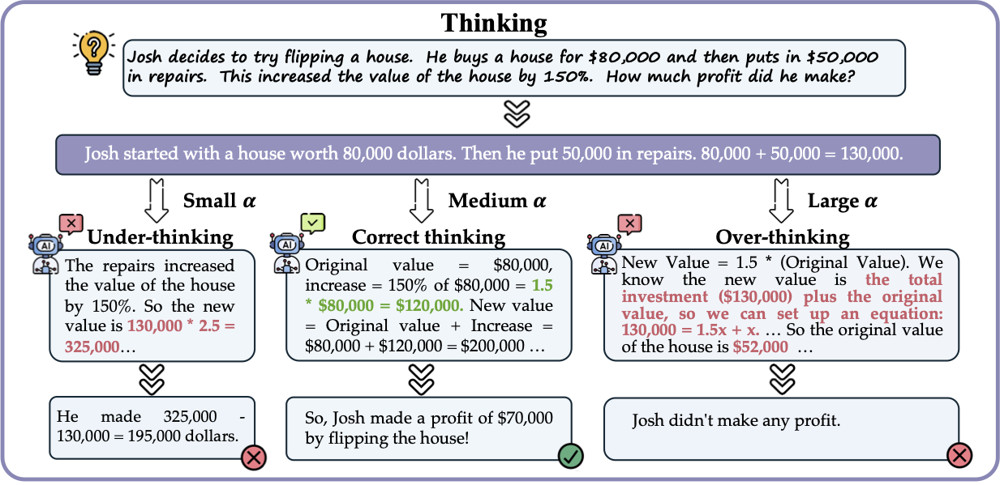

# FractionalReason

A research framework for evaluating and improving large language model (LLM) reasoning through latent shifting techniques and advanced evaluation methods.




## Overview

FractionalReason is a **training-free and model-agnostic framework** that enables continuous control over reasoning intensity at inference time. Unlike existing test-time compute methods that apply reasoning uniformly across inputs, Fractional Reasoning recognizes that different problems require different levels of reasoning depth.

The framework operates by extracting **latent steering vectors** associated with deeper reasoning and reapplying them with tunable scaling factors, allowing models to tailor their reasoning process to the complexity of each input. This approach goes beyond the limitations of fixed instructional prompts and supports two key modes of test-time scaling:

1. **Breadth-based strategies**: Improving output quality through Best-of-N and majority voting
2. **Depth-based strategies**: Enhancing individual reasoning chain correctness through self-reflection

## Under construction
We are still working on this repository, so please let us know if you find any issue or problem while runing the code. 

## Supported Models

- **Qwen2.5** 
- **Llama-3** 
- **R1Qwen** (reasoning-optimized variant)
- Any HuggingFace-compatible causal language model

## Supported Datasets

**Primary evaluation datasets (as tested in the paper):**
- **GSM8K**: Grade school math problems
- **MATH-500**: Mathematical reasoning (HuggingFaceH4/MATH-500)
- **GPQA**: Graduate-level science questions (Idavidrein/gpqa)

## Project Structure

```
FractionalReason/
├── exp/                          # Experimental scripts
│   ├── run_fr_with_matjority_vote.py    # Majority voting with Fractional Reasoning
│   ├── run_fr_with_rm.py                # Reward model scoring with latent steering
│   └── run_original_model.py            # Baseline model evaluation
├── utils/                        # Utility functions
│   ├── eval_utils.py            # Evaluation metrics and utilities
│   ├── data_utils.py            # Data loading and preprocessing
│   ├── llm_layers.py            # Model layer modifications for latent steering
│   ├── score_outputs.py         # Output scoring and ranking
│   └── tools.py                 # General utility functions
├── tasks/                        # Task definitions and data loaders
│   ├── base.py                  # Base task class with steering vector computation
│   ├── loader.py                # Dataset loading utilities
│   └── demo.py                  # Demonstration task handler
├── models/                       # Model loading and configuration
│   └── huggingface.py           # HuggingFace model 
experiments
├── records/                      # Experimental results
│   ├── rewarded_majority_vote/  # Results with reward model scoring
│   └── plain_majority_vote/     # Results with simple majority voting
├── anchor.py                     # Path configuration
└── common.py                     # Shared utilities and argument parsing
```

## Setup

### Prerequisites

- **Python 3.8+** (Python 3.10+ recommended)
- **CUDA-compatible GPU** (recommended for model inference)
- **Git LFS** (for large model files)
- At least **16GB GPU memory** for 7B models, **32GB+** for larger models

### Installation

1. **Clone the repository:**
```bash
git clone <repository-url>
cd FractionalReason
```

2. **Create and activate a virtual environment:**
```bash
# Using conda (recommended)
conda create -n fractional-reason python=3.10
conda activate fractional-reason

# Or using venv
python -m venv fractional-reason
source fractional-reason/bin/activate  # On Windows: fractional-reason\Scripts\activate
```

3. **Install dependencies:**
```bash
# Install from requirements file
pip install -r requirements.txt

# Or install manually
pip install torch>=1.12.0 transformers>=4.21.0 datasets>=2.0.0 numpy>=1.21.0 tqdm>=4.64.0 bitsandbytes>=0.37.0
```

4. **Configure paths in `anchor.py`:**
```python
# Update the checkpoints_root to your HuggingFace cache directory
checkpoints_root = Path("/your/path/to/huggingface/cache")
```

2. **Model Download Issues:**
   ```bash
   # Set up Git LFS if not already installed
   git lfs install
   
   # Clear HuggingFace cache if corrupted
   rm -rf ~/.cache/huggingface/transformers
   ```

3. **Permission Errors with Models:**
   ```bash
   # Make sure you have access to gated models
   huggingface-cli login
   ```

4. **bitsandbytes Installation Issues:**
   ```bash
   # Install specific CUDA version
   pip install bitsandbytes-cuda111  # for CUDA 11.1
   pip install bitsandbytes-cuda118  # for CUDA 11.8
   ```

**Performance Tips:**
- Use `torch.compile()` for faster inference (PyTorch 2.0+)
- Enable gradient checkpointing for memory efficiency
- Use mixed precision training with `torch.autocast()`

## Usage

### Fractional Reasoning with Majority Vote

Run a basic evaluation with majority voting and Fractional Reasoning:

```bash
python exp/run_fr_with_matjority_vote.py \
    --model_type Qwen2.5 \
    --model_size 7b \
    --dataset gsm8k \
    --num_trials 5
```

### Fractional Reasoning with Reward Model

Use reward model scoring for sample selection:

```bash
python exp/run_fr_with_rm.py \
    --model_type Qwen2.5 \
    --model_size 7b \
    --dataset gsm8k \
    --num_trials 5
```

### Baseline Comparison

Run the original model without fractional reasoning for comparison:

```bash
python exp/run_original_model.py \
    --model_type Qwen2.5 \
    --model_size 7b \
    --dataset gsm8k
```


## Results Structure

Results are saved in JSON format under the `records/` directory:
- Detailed per-question results with generated responses

## Citation

If you use this code in your research, please cite:

```bibtex
@article{liu2025fractional,
  title={Fractional Reasoning via Latent Steering Vectors Improves Inference Time Compute},
  author={Liu, Sheng and Chen, Tianlang and Lu, Pan and Ye, Haotian and Chen, Yizheng and Xing, Lei and Zou, James},
  journal={arXiv preprint arXiv:2506.15882},
  year={2025}
}
```

## License
MIT license

## Contact

For questions or issues, please shengl@stanford.edu.
